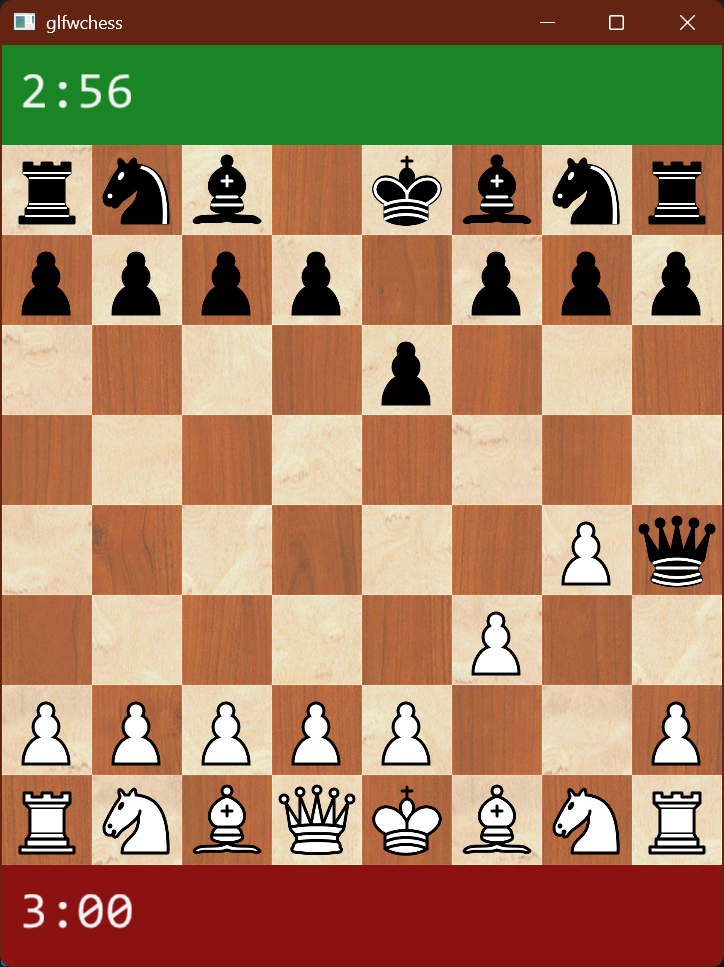

# glfwchess



Minimal GLFW + C++ chess GUI that links the sibling `magic_bitboard` engine.

## Layout

- `CMakeLists.txt` builds the app and pulls in GLFW with `FetchContent`
- `src/main.cpp` initializes the engine, prints a sample position, and opens a window

## Build

From `c:\Git\chess\glfwchess`:

```bash
cmake -S . -B build
cmake --build build
```

The project expects the sibling folder `../magic_bitboard` to remain in place.